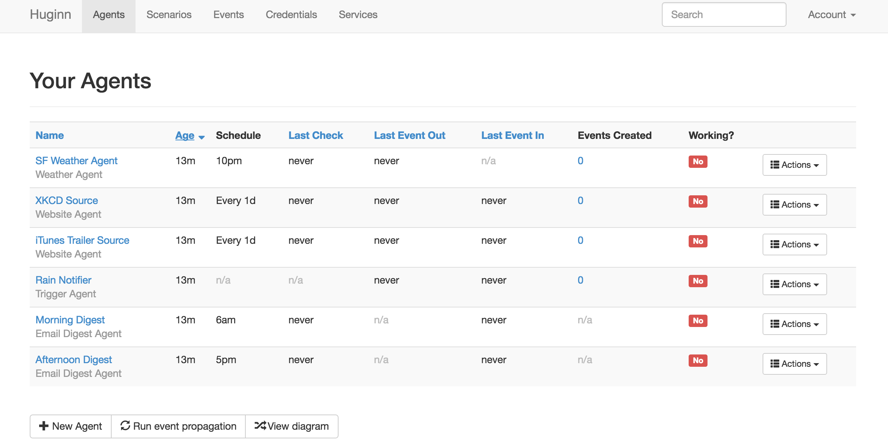
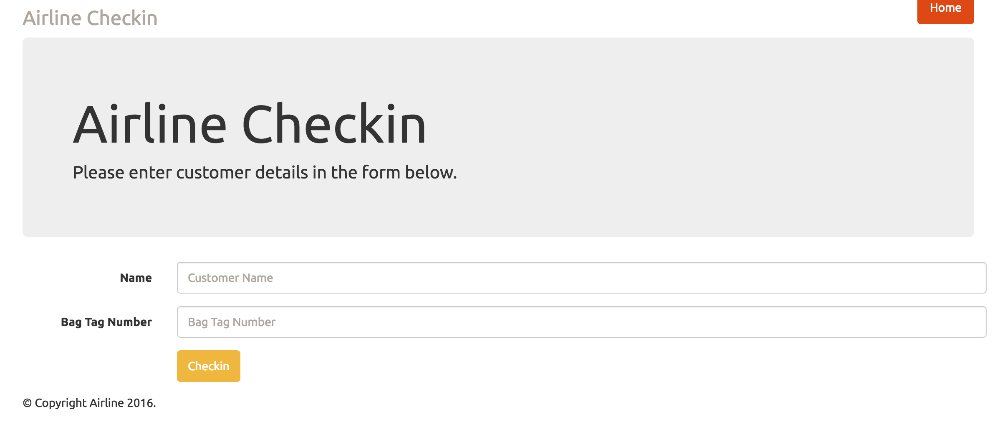
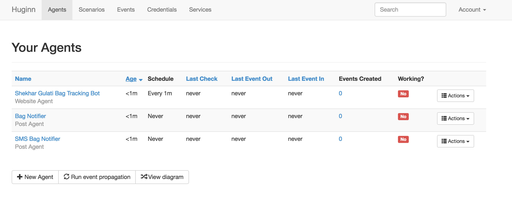
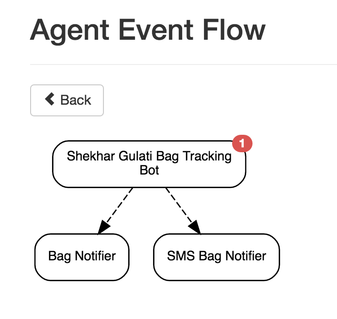
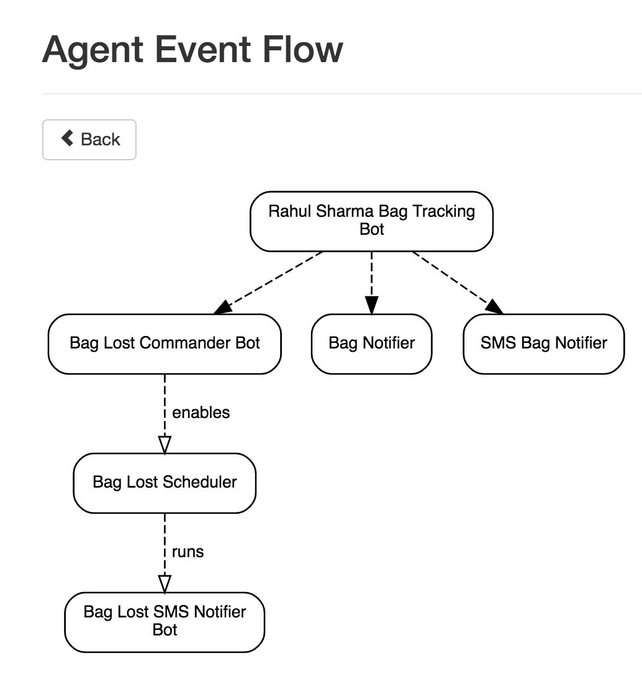

Airline Bot Platform with Huginn
-----

Welcome to fifteenth week of [52 Technologies in 2016](https://github.com/shekhargulati/52-technologies-in-2016) blog series. This week I participated in a day long Hackathon organized by an Airline. They were looking for ideas that could help improve customer travel experience. I, along with my good friend [Rahul](https://www.linkedin.com/in/rahul-sharma-72531111) decided to build a bot platform using [Huginn](https://github.com/cantino/huginn) that can perform a lot of tasks for which we normally use mobile apps. Our goal was to show them that they should think beyond mobile apps and look into the world of bots as bots can be less intrusive, more secure, and does not require installation. ***Apps are dead, long live bots.***

Bots are small applications that can perform certain tasks on user behalf, or react to events, or send notifications. To show them power of bots, we decided to build a bag tracking system using bots that sends an SMS notification to the passenger as soon as flight lands with information about whether their bag was loaded in the same flight or not. We integrated our bots platform with a mock checkin system so as soon as the passenger checks in, a bot is created for the passenger that tracks their bag journey. I find it very annoying that after waiting for an hour or more at the airport conveyer belt I am told that my bag was not loaded in the same flight. I have lost my bag three times at three different international airports Heathrow Airport London, Adolfo Suárez Madrid–Barajas Airport, and Amsterdam Airport Schiphol and each time I had to go through the painful process.

> **This blog is part of my year long blog series [52 Technologies in 2016](https://github.com/shekhargulati/52-technologies-in-2016).**

## Why bots?

In my opinion, the biggest advantage of using bots is that they can have a definite lifetime and does not require installation on end user mobile device. Let's take the bag tracking use case I described above, bot can self destruct itself as soon as the passenger receives his or her bag. I may sound like an old school guy but I find installing mobile apps for use cases like I mentioned is asking for too much from the end customer. I learnt about a cool app [http://webkay.robinlinus.com/](http://webkay.robinlinus.com/) that shows how much a modern web browser reveals about the user. Mobile apps have much more access so you can think how much you are sharing unintentionally.

## Other bot use cases for Airlines

There are many use cases that bots can be used for. These are some of the use cases that I can think of right now:

1. A bot that tracks flight arrival information, books a taxi, informs the driver, and send an SMS to passenger with driver details.
2. A bot that tracks flight information and send notifications to the loved ones about the journey.
3. A bot that sends you an email with your ticket 2 hours before your flight.
4. A bot that listen to baggage lost Twitter stream for an airline and auto reply to the frustrated user with a personalized message.
5. A bot that sends me an email with a list of 10 articles(you can scrape the article content) based on my twitter favorites or any other read it later app that I can read during the flight.

## Building a bot platform

In this section, I will showcase how we built baggage tracking system using Huginn. According to [Huginn website](https://github.com/cantino/huginn) ,

> **Huginn is a system for building agents that perform automated tasks for you online. They can read the web, watch for events, and take actions on your behalf. Huginn's Agents create and consume events, propagating them along a directed graph. Think of it as a hackable Yahoo! Pipes plus IFTTT on your own server. You always know who has your data. You do.**

### Step 1: Getting started with Huginn

Huginn is a Ruby on Rails application. The easiest way to get started with it is to run it inside a Docker container. Assuming, you have Docker Machine installed on your machine. You can create a new Docker machine instance or use existsing and start playing with Huginn.

```bash
$ docker-machine create --driver virtualbox huginn
$ docker-machine start huginn
$ eval "$(docker-machine env default)"
$ docker run -it -p 3000:3000 cantino/huginn
```

If you need more information, please refer to the [documentation page](https://github.com/cantino/huginn/blob/master/doc/docker/install.md).

To access Huginn, you have to get hold of your docker machine instance. You can get that using following command.

```bash
$ docker-machine ip huginn
```

Now, you can view the Huginn instance running at http://docker_machine_ip:3000/. Please replace `docker_machine_ip` with the ip of your machine instance. You will see Huginn web application as shown below.


You can login into Huginn system using the **admin/password** combination. Once you login using the default credentials, you will see 6 agents already created for you.  



> **You can think of bots as Huginn agents as Huginn call them agents. I will use Agents and Bots interchangeably.**

If you want to learn more about default agents, then you can refer to [wiki](https://github.com/cantino/huginn/wiki#using-huginn) to learn more about them.

### Step 2: Integrate checkin system with Huginn

Now, that Huginn is up and running we can connect it with the Airline checkin system. We created a mock checkin system so that we can show the workflow. When airline does the checkin for a passenger, they will make an HTTP `POST` to the Huginn server to create a new Huginn agent.

> **Huginn currently does not provide a REST API to perform various tasks like creating an Agent. So, we are submitting a form request.**

Huginn supports many different kind of agents. There are agents to send notification like SMS and email, make POST request to other services, scheduler agent to take action at periodically, translation agent, user location agent, etc. You can also create your own agents in Ruby. To learn more about creating agents, you can refer to [documentation](https://github.com/cantino/huginn/wiki/Creating-a-new-agent).

We created a quick and dirty Python Flask application that renders a form as shown below.



When the airline submits the data, the `track_bag` endpoint is called which makes the `HTTP POST` to the Huginn server to create an agent.

```python
from flask import Flask, render_template, request, redirect, url_for, flash

app = Flask(__name__)

@app.route("/")
def index():
    return render_template('index.html')

@app.route("/trackbag",methods=['POST'])
def track_bag():
    name = request.form['name']
    bag_tag = request.form['bagTag']
    flash("You have successfully submitted request for {0}".format(name))
    create_agent(name,bag_tag)
    return redirect(url_for('index'))

if __name__ == "__main__":
    app.run(host= '0.0.0.0',debug=True)
```

The code shown below is a simple Python Flask app that does the following:

1. We imported all the required classes and methods of the Flask API
2. We created an instance of Flask app
3. When a `HTTP GET` request is made to `\`, then `index.html` page is rendered. It contains the checkin form.
4. The checkin form is submitted to the `track_bag` method. We get the customer `name` and `bagTag` from the request and call the `create_agent` method that creates Huginn agent.
5. Finally, we `redirect` airline agent to the checkin page again.

The `create_agent` method shown above create the Huginn agent. Let's look at its code.

```python
import requests
import json

def create_agent(name, bag_track):
    headers = {'Content-Type':"application/x-www-form-urlencoded",'Cookie':"COOKIE"}

    agent_name = name + " Bag Tracking Bot"
    poll_url = "http://192.168.1.2:3000/bagInfo"

    agent_options =  {'expected_update_period_in_days':0,'url':poll_url,'type':"json","mode":"on_change","extract": {'bag_status':{'path':"$.[:-1].event[:-1].event_code"}}}

    request_data = {'return':'','agent[type]':"Agents::WebsiteAgent",'agent[name]':agent_name,'agent[schedule]':"every_1m",'agent[control_target_ids][]':"",'agent[keep_events_for]':0,'agent[source_ids][]':"",'agent[propagate_immediately]':1,'agent[options]':json.dumps(agent_options),'commit':"Save",'authenticity_token':"AUTHENTICITY_TOKEN"}
    res = requests.post("http://192.168.99.100:3000/agents",headers=headers,data=request_data)
    return res
```

In the code shown above, we are doing the following:

1. using the Python `requests` API to submit the form programmatically.
2. We set the request headers. As we are submitting a form so we are using content type as `application/x-www-form-urlencoded`.
3. We created an agent using the customer name.
4. In the `POST` request body, we set the agent type to `WebsiteAgent`. `WebsiteAgent` polls a URL periodically as defined by the `schedule` parameter and publish events. A agent can have options as defined in `agent_options` dictionary. We have defined `poll_url` to be `http://192.168.1.2:3000/bagInfo`. When bot/agent will hit this URL, it will return a JSON response with bag details. We will cover this later. The `extract` parameter inside the `agent_options` define what we want to extract from the JSON returned by `http://192.168.1.2:3000/bagInfo` endpoint. We are using JSONPath expression `$.[:-1].event[:-1].event_code`. The expression means get the last JSON document in the array, then within that document give me the last event, and from the event return me  the `event_code`. This will help us extract the last bag tracking event.
5. Finally, we make the `POST` request to the Huginn server using the `request_data` and `headers`.

### Step 3: Submit checkin form to create agents

Let's test that our checkin system is integrated with the Huggin. Submit the checkin form with customer name and bag tag. You will see one bot created for you.


Bag Tracking bot will start making `GET` request to `http://192.168.1.2:3000/bagInfo` every one minute. As we have not started the bag tracking server so bot will show error in the logs.


### Step 4: Get bag tracking information

During this Hackathon, I learnt that there is a provider SITA that provides real time information about bag information. They have a [Bag Journey API](https://www.developer.aero/BagJourney-API/API-Overview) that  provides a simple interface into the complex world of baggage management by allowing the retrieval of the real time status of a specific bag, a list of bags on a particular flight or a list of events that describe the journey of a checked in bag or list of bags. **BagJourney API access is only available to Airlines, Airports or their accredited software providers**. To demo our use case, we decided to use a mock REST server that returns JSON documents we specify. We used [json-server](https://github.com/typicode/json-server) as it is very easy to use and met our needs.

`json-server` is a node.js application that you can install using `npm` as shown below.

```
$ npm install -g json-server
```

Once `json-server` is installed, we started the bag tracking API server using default data.

```
$ json-server --watch db.json
```

`db.json` looks like as shown below. It has one `CHECKED_IN` event for the bag with tag `aaa`.

```json
{
  "bagInfo": [
    {
      "bagtag": "aaa",
      "no_of_checked_bags": 3,
      "passenger_first_name": "JOHN",
      "passenger_last_name": "SMITH",
      "total_weight_of_checkedin_bags": 33.5,
      "weight_indicator": "K",
      "event": [
        {
          "airport": "DEL",
          "event_code": "CHECKED_IN",
          "local_date_time": "2016-08-27T13:00:00-0400",
          "read_location": "DCQW",
          "sent_location": "B2",
          "stowage_device": "AKE12345BD",
          "utc_date_time": "2013-08-27T13:00:00Z"
        }
      ]
    }
  ]
}
```

In the next poll i.e. after one minute, our bag tracker will extract the event from the JSON and will emit an event and you will see one event as shown below.


You can see all the published events at http://docker_machine_ip:3000/events. You can clearly see that we extracted `CHECKED_IN` from the JSON and emitted an event.


### Step 5: Setting up notifier bots

So, our bag tracking bot is publishing events, now we need bots that can listen to those events. We will add two notifier bots -- one for email and another for SMS. We will use Gmail to send email and Twillo for sending SMS. Huginn provides `Email Agent` that sends any event it receives in an email. We will use Huginn email agent for sending out email. To send SMS, we will use Twillo API. We will create a new agent `Post Agent`. Post Agent sends an HTTP POST request to URL and then you can do whatever you want with request. We will update our Flask app so after creating bag tracker bot it also creates email and sms bots as well.

```python
@app.route("/trackbag",methods=['POST'])
def track_bag():
    name = request.form['name']
    bag_tag = request.form['bagTag']
    create_agent(name,bag_tag)
    bag_tracker_agent_id = read_agent_id()
    create_email_agent(bag_tracker_agent_id)
    create_sms_agent(bag_tracker_agent_id)
    flash("You have successfully submitted request for {0}".format(name))
    return redirect(url_for('index'))
```

As you can see above, we are creating email and SMS agent using the `create_email_agent` and `create_sms_agent` methods. The email and SMS agent make use of the bag tracker agent id. They will use bag tracker agent as their source. In Huginn, you can create agent chain where one agent can depend on other agents. The code for `create_email_agent` and `create_sms_agent` is similar to the `create_agent` discussed above. Below is the code that we are using to create Twillo powered SMS agent.

```python
def create_sms_agent(agent_id):
    headers = {'Content-Type':"application/x-www-form-urlencoded",'Cookie':"COOKIE"}

    agent_name = "SMS Bag Notifier"

    payload = {"bag_status":"{{ bag_status }}"}
    agent_headers = {"CONTENT_TYPE":"application/json"}

    agent_options =  {"post_url": "http://192.168.1.2:5000/send_sms", "expected_receive_period_in_days": "0", "content_type": "json", "method": "post", "payload": payload,"headers": agent_headers, "emit_events": "false","no_merge": "false"}

    request_data = {'return':'','agent[type]':"Agents::PostAgent",'agent[name]':"SMS Bag Notifier",'agent[schedule]':"never",'agent[control_target_ids][]':"",'agent[keep_events_for]':0,'agent[source_ids][]':"",'agent[propagate_immediately]':0,'agent[source_ids][]':agent_id,'agent[options]':json.dumps(agent_options),'commit':"Save",'authenticity_token':"AUTHENTICITY_TOKEN"}

    res = requests.post("http://192.168.99.100:3000/agents",headers=headers,data=request_data)
    return "OK"
```

This time we have used `PostAgent` agent type and gave it the url `http://192.168.1.2:5000/send_sms`. This task is not scheduled so we have set schedule to `never`. The source of this agent is set to the agent id of the bag tracking bot id.

The `send_sms` REST end point will be invoked by Huginn `POSTAgent`. It uses Python `requests` library to make `HTTP POST` request to Twillo API.

```python
@app.route("/send_sms",methods=['POST'])
def send_sms():
    content = request.get_json(silent=True)
    twillo_url = "https://api.twilio.com/2010-04-01/Accounts/AccountID/Messages.json"
    request_data = {'To':"TO_NUMBER",'From':"FROM_NUMBER","Body":msg.format(content.get('bag_status'))}
    requests.post(twillo_url,data=request_data, auth=('ACCOUNT_SID','AUTH_TOKEN'))
    return "OK"
```

Now, if you register a new passenger using the Checkin system three agents will be created.



You can view the event flow by clicking the `View diagram` link on the `agents` page.



To see all the three agents in action, let's add couple more JSON documents to the `db.json`. These JSON will contains `SCREENED` and `LOADED_ON_AIRCRAFT` events.

You will notice that bag tracking bot has published three events and you will start getting email and SMS.

### Step 6: Bag lost notification

So far we have seen the happy path when the bag is loaded on the air craft and you will get `LOADED_ON_AIRCRAFT`. The `LOADED_ON_AIRCRAFT` event is sent when the bag is loaded in the aircraft. We will notify user that his/her baggage was lost(i.e. will not be coming in the same flight) if by the time passenger flight landed `LOADED_ON_AIRCRAFT` message is not received by our system.

To achieve this we will set up another scheduled bot that will send baggage lost SMS after flight time. For every passenger this bot will be scheduled. There will be another bot that will be listening only to the `LOADED_ON_AIRCRAFT` events if it receives the message within flight duration then it will disable the scheduled bot.


The event flow in this use case is shown below.



The **Bag Lost Commander Bot** is subscribed for messages of type `LOADED_ON_AIRCRAFT`. This bot will disable its child bots if it receives the `LOADED_ON_AIRCRAFT` message. Otherwise, it will send the `BAG_LOST` message to the customer.

-----

That's all for this week.

Please provide your valuable feedback by posting a comment to [https://github.com/shekhargulati/52-technologies-in-2016/issues/19](https://github.com/shekhargulati/52-technologies-in-2016/issues/19).

[](https://github.com/igrigorik/ga-beacon)
